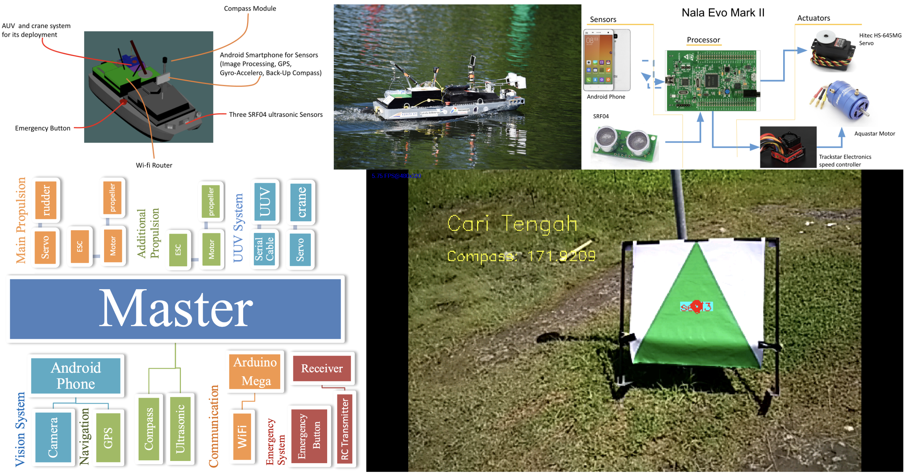

*9th International Roboboat Competition - self-directed project at Barunastra Roboboat ITS.*

**Team:** Rudy D., Darwin S., Yohan P., Muhammad Bahru Sholahuddin, Ericza D. S., Anas M. N.

### My Responsibility:
Developed an Android-based object detection system using OpenCV, integrated with external sensors, and designed a communication pipeline between the Android application and a microcontroller via Bluetooth.

### Strategy:
- Developed an object detection pipeline that performed segmentation, filtering, and object detection. Utilized color thresholding, noise reduction (Median and Gaussian filters), and morphological operations (Erosion and Dilation) to refine object boundaries.
  
- Implemented algorithms to classify objects based on Hue-Saturation-Value (HSV) color space and geometric features, such as form factor and number of edges, enabling the system to distinguish between various objects in the competition environment.

- Tested the detection algorithm on recorded videos from the water field using a custom C++ program built with CMake to evaluate system performance.

- Created individual Java activities for each object type, extracting feature data (e.g., Hue, Saturation, Value, shape parameters, morphological properties) for real-time analysis within the app.

- Adjusted Android camera settings like auto-focus, white balance, and exposure to improve detection robustness in varying outdoor lighting conditions.

- Retrieved and processed raw sensor data from Android’s GPS, light, accelerometer, gyroscope, and magnetometer for orientation data. Designed the system to reset orientation values easily, improving synchronization with detection.

- Established communication with an STM32F4 microcontroller via UART over Bluetooth. Designed a custom parsing system to transmit real-time 2D object position data, along with sensor data (GPS, light, orientation), to the microcontroller for decision-making. Retrieved command data from the microcontroller to update the Android system with mission states.

### Links:
- [GitHub](https://github.com/MRoboSub/mrobosub/blob/devel/mrobosub_perception/src/hsv_pipeline.py)
- [Paper](https://robonation.org/app/uploads/sites/3/2019/10/ITSN_RB16_Paper.pdf)
- [Competition Rules and Tasks](https://drive.google.com/file/d/0BzV2g6noYWvrcllVVjJzWDJMbU0/view?usp=sharing&resourcekey=0-r_J7uLPxqzsBOr-YExZiJg)
- [Application](https://drive.google.com/file/d/19wvUKwV2xPmhx0Rs0UimR88snFOb-KrW/view?usp=sharing)

### Preview:

