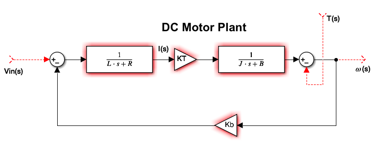
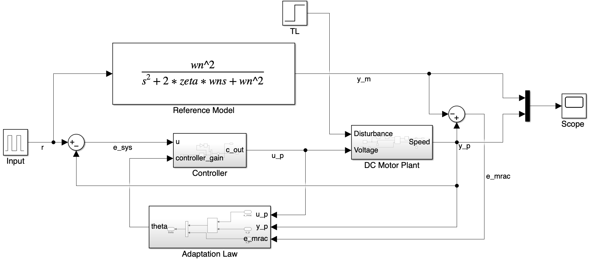

*(NA583 - Adaptive Control) self-directed class final project at the University of Michigan.*

**Team:** Max Wu, Nick Boston, Muhammad Bahru Sholahuddin.

### My Responsibility:
Derived the mathematical model of the DC motor and designed the Model Reference Adaptive Control (MRAC) system in Simulink.

### Strategy:
- Derived the mathematical model of the DC motor by applying Kirchhoff's Voltage Law to the electrical circuit and Newton's second law to the mechanical system. This resulted in a transfer function that represents the relationship between input voltage and angular velocity. The model was characterized as a second-order system with parameters including torque constant ($$K_t$$), armature inductance ($$L$$), armature resistance ($$R$$), shaft moment of inertia ($$J$$), viscous friction coefficient ($$\beta$$), and back EMF constant ($$K_b$$).
- Designed the Model Reference Adaptive Control (MRAC) system using the direct Lyapunov method, ensuring the stability of the system through the Strictly Positive Real (SPR) condition. The reference model was implemented as a second-order system, chosen to match the desired performance characteristics of the DC motor.
- Implemented the adaptive control law in Simulink, which continuously adjusts the control gains to minimize the error between the actual motor speed and the desired reference model response. The adaptation mechanism was designed to cope with uncertainties in the motor parameters and external perturbations.
- Developed a custom script to automate the initialization of the controller and plant parameters in Simulink, allowing for quick reconfiguration of the system.
- Simulated different operating conditions in Simulink to test the MRAC system's robustness, analyzing performance under various scenarios.

### Links:
- [Project Report](https://drive.google.com/file/d/1EqPa1PUWieJr8wyfv5K7RIT7E4n0ZPSb/view?usp=sharing)

### Preview:

