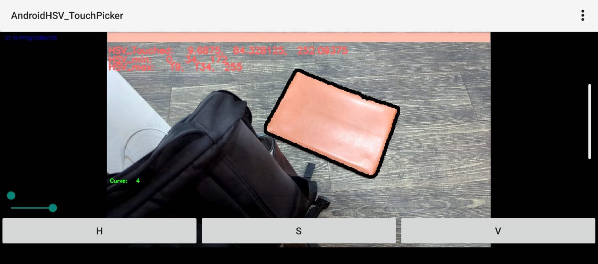

*Self-project during my role as a junior programmer at Barunastra Roboboat ITS.*

### My Responsibility:
Developed an interactive Android application to segment objects based on their Hue-Saturation-Value (HSV) color and enable easy selection and adjustment of HSV parameters through a touch interface.

### Strategy:
- Implemented OpenCV for Android to process live camera frames and convert them to HSV color space.
  
- Allowed users to adjust HSV range values dynamically using a touch interface, which triggered updates to filter and display objects based on selected HSV values.

- Detected and highlighted objects in real-time by applying color-based segmentation, while displaying the detected object's features such as Hue, Saturation, and Value.

- Developed interactive SeekBars for adjusting the HSV thresholds and provided live feedback as users refined the settings.

- Designed custom UI components to enable users to touch areas on the live camera feed and retrieve the HSV value of the selected point.

- Used OpenCV’s contour detection to extract object boundaries and provide a visual overlay on detected objects in the camera feed.

- Enabled color calibration through manual selection and tuning of HSV parameters, making the application useful for vision-based robotic applications such as obstacle detection.

### Links:
- [GitHub](https://github.com/mbsbahru/android-hsv-pick)
- [Application](https://drive.google.com/file/d/1NhF9o5D2DPzwKQo5v9N8kOdDGCv6tQhN/view?usp=sharing)

### Preview:

