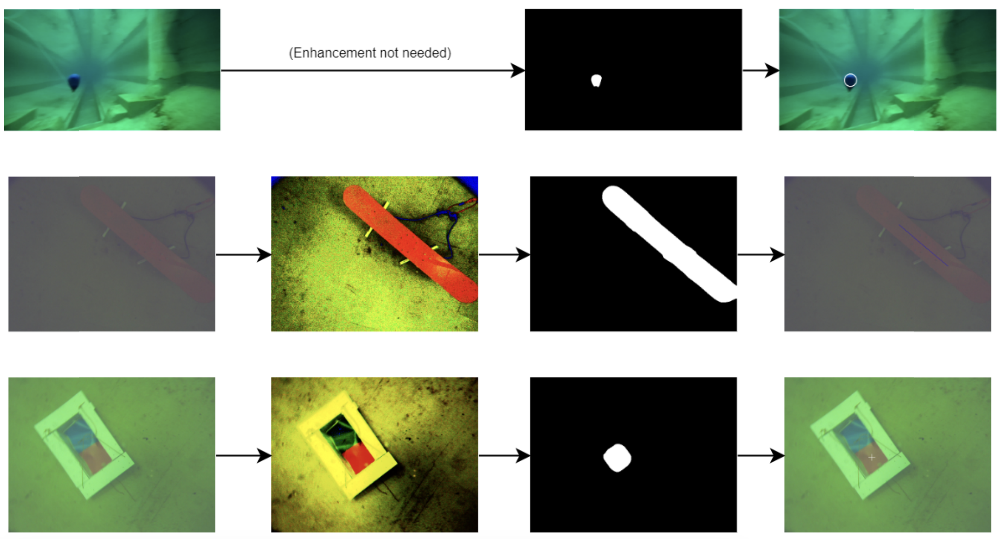

As a software developer for the [Michigan Robotic Submarine](https://www.michiganrobosub.com/) team.

*Team*: Nolan Kuza, Muhammad Bahru Sholahuddin, Diego Montemayor, Kathryn Wakevainen
Kobi Wettstein, Adarsh Ponaka, Elaina Mann, Melissa Peters, Arnav Mummineni, Jennifer Chin,
Alexander Bowler, Tong Sing Wu, Shrey Sahgal, Emi Yuki, Shubh Agrawal, Andrew Huston.

### My Responsibility:
Detecting and localizing underwater objects efficiently for autonomous navigation.

### Strategies:
- **Image Enhancement:** Applied histogram equalization and white balance for improved visibility.
- **Object Segmentation:** Used efficient HSV thresholding methods for segmenting objects.
- **Refinement:** Utilized smoothing techniques, morphological operators, and Convex Hull to clean up segmentations.
- **Classification:** Analyzed features like vertices, areas, and edge ratios to classify objects.
- **Information Extraction:** Extracted key metrics such as centroid position, area, and orientation.
- **Software Tools:** Developed a Python desktop program for testing and integrated new algorithms into the team's ROS pipeline.

### Links:
- [GitHub (HSV Pipeline)](https://github.com/MRoboSub/mrobosub/blob/devel/mrobosub_perception/src/hsv_pipeline.py)
- [Team Paper](https://robonation.org/app/uploads/sites/4/2024/07/RS24_TDR_Univ-of-Michigan.pdf)
- [Competition Rules and Tasks](https://robonation.org/app/uploads/sites/4/2024/07/2024-RoboSub_Team-Handbook_v2.pdf)

### Preview:

