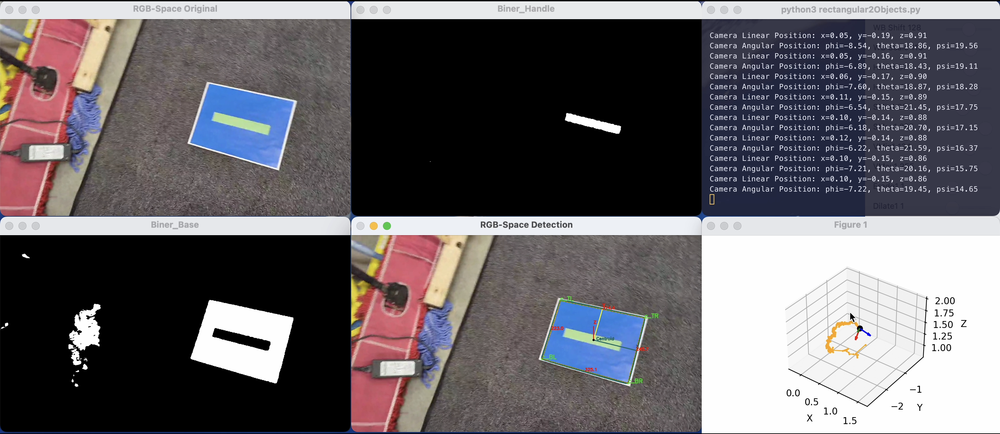

## Visual Path Planning for Underwater Manipulation (2024)

As part of the self-directed class final project for [ROB572 - Marine Robotics](https://www.umich.edu/), at the University of Michigan.

**Team:** Muhammad Bahru Sholahuddin, Kathryn Wakevainen.

### My Responsibility:
I developed a Python program to estimate the 3D linear and angular poses (surge, sway, heave, roll, pitch, yaw) of underwater objects relative to a camera frame of reference and vice versa. The application provided either recorded or real-time visualization of the 6-Degree-of-Freedom (6-DoF) motion trajectory, displaying the camera's position and orientation. I also evaluated the algorithm's performance to ensure the accuracy and reliability of pose estimations.

### Strategy:
- Segmented two underwater objects using HSV thresholding to differentiate between various color profiles. The segmentation was refined with smoothing techniques, contour treatment, and color enhancements to improve detection accuracy in low-visibility underwater environments.
- Developed an algorithm to identify and track the corner vertices of the objects in real-time, extracting features such as vertex positions and edge lengths for geometric classification.
- Performed camera calibration using Matlab, estimating intrinsic parameters such as the optical center, focal length, skew coefficient, and distortion coefficients to correct lens distortions.
- Applied the Perspective-n-Point (PnP) algorithm, Rodrigues' rotation formula, and inverse transformations to compute the camera’s linear ($x$, $y$, $z$) and Euler angular positions ($\phi$, $\theta$, $\psi$) relative to the object’s frame.
- Implemented an online low-pass filter to smooth trajectory data, reducing the impact of noise and sudden fluctuations for stable motion representation.
- Calculated and displayed reprojection error for each frame to assess pose estimation accuracy, providing insights for further improvement.
- Visualized the 6-DoF motion trajectory of the camera relative to the object’s frame using Matplotlib, with detailed plots showing the path and orientation of the camera and objects.

### Links:
- [Paper & Code Attachment](https://drive.google.com/file/d/16MCcvLWL8GJQi-GOwGc-1yQGixkHIaVR/view?usp=sharing)
- [Video](https://drive.google.com/file/d/10Y9cqwjod6CYPV-1pDYdJVSm2V84LhuZ/view?usp=sharing)

### Preview:

