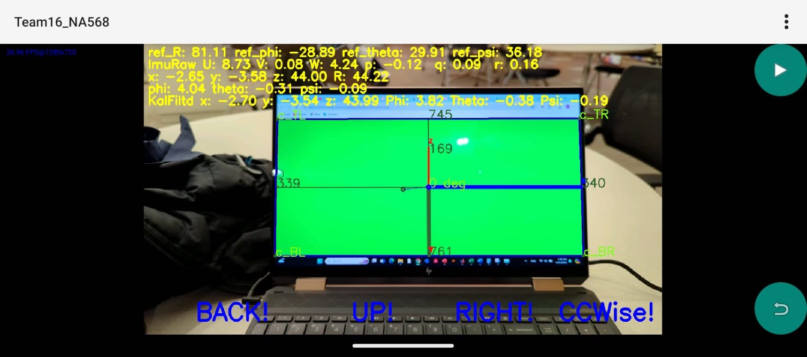
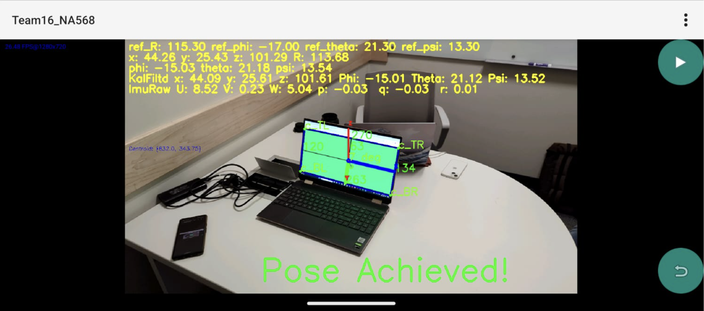

As part of the [ROB530 - Mobile Robotics](https://github.com/UMich-CURLY-teaching/UMich-ROB-530-public) self-directed class final project at the University of Michigan.

**Team:** Muhammad Bahru Sholahuddin, Mohammed Buhlaigah, Zih-En Tseng, Usman Shahzad.

### My Responsibility:
Developed an Android application to perform 3D linear and angular pose estimations (surge, sway, heave, roll, pitch, yaw) using a single-vision camera relative to the object's frame of reference. The estimations were refined using the Android accelerometer and gyroscope sensors, applying a Kalman filter and integrating the team's filtering and control algorithms into the application.

### Strategies:
- **Object Segmentation:** Implemented HSV object segmentation along with noise reduction techniques such as smoothing and morphological operations. Contour refinement was achieved using Convex Hull.
- **Feature Extraction:** Extracted object features, including centroid, edges, and vertices, displaying their positions within the camera's 2D frame.
- **Camera Calibration:** Calibrated the camera to determine intrinsic parameters like the optical center, focal length, skew coefficient, and distortion coefficients.
- **Pose Estimation:** Applied the Perspective-n-Point (PnP) algorithm to calculate the object’s translation vector and rotation matrix relative to the camera frame.
- **Frame Transformation:** Performed inverse frame transformation to use the object as the reference, obtaining the camera’s linear ($$x$$, $$y$$, $$z$$) and Euler angular positions ($$\phi$$, $$\theta$$, $$\psi$$).
- **Sensor Data Processing:** Processed accelerometer and gyroscope data from the Android device for Kalman filtering.
- **Control Algorithms:** Integrated frequency-based filtering and bang-bang control algorithms into the Android project.
- **Motion Guidance:** Developed a feature to save and reset the desired 6 DoF position and orientation, along with providing motion guidance based on in-frame positions.

### Links:
- [GitHub (Pose Perfect Project)](https://github.com/mbsbahru/Pose_Perfect)
- [Poster](https://docs.google.com/presentation/d/1ZVLhKT2xRZvxd_b7FyPOwXysKnrry6pg24x-qFHhQ1k/edit?usp=sharing)
- [Paper](https://drive.google.com/file/d/1wzO3Bb32BaxBVvxDnijjk-b8pXrSOTyf/view?usp=sharing)
- [Android Application](https://drive.google.com/file/d/1H8T5yAWxWS_5-SAM8eWqe3GmNhLwfa4T/view?usp=sharing)

### Preview:

