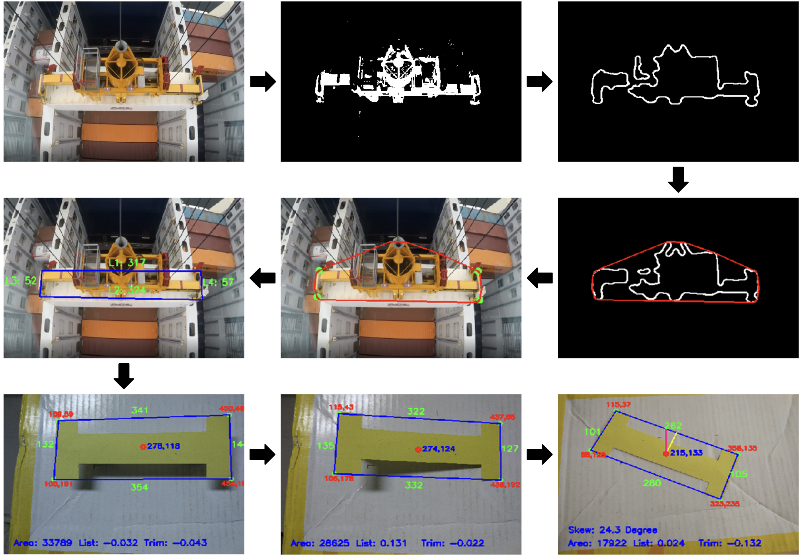

*Final Project at the Institut Teknologi Sepuluh Nopember.*

**Team:** Muhammad Bahru Sholahuddin, Dr. A. A. Masroeri (Advisor), Juniarko Prananda, M.T. (Adv.).

### My Responsibility:
Developed a computer vision-based system to detect the Container Crane (CC) spreader and estimate its 3D orientation. Designed and implemented algorithms for image segmentation, noise reduction, and feature extraction to identify the spreader's position and motion parameters.

### Strategy:
- Conducted experiments to determine how changes in lighting conditions affect the accuracy of HSV-based color segmentation. This analysis aimed to develop a segmentation algorithm that could handle varying illumination in an outdoor environment.
- Converted RGB images to HSV color space and applied adaptive thresholding to segment the spreader from the background. Used Median and Gaussian filters for noise reduction, followed by morphological operations (erosion, dilation) to eliminate small artifacts. Applied the Convex Hull algorithm for accurate contour detection of the spreader.
- Identified the spreader's corner points and calculated its geometric properties (centroid, area, orientation angles). Used these features to estimate the spreader's pose (position and orientation) relative to the camera and calculate motion parameters such as sway, skew, trim, and list rates.
- Integrated the algorithm into a simulated environment to evaluate the system's performance in detecting the spreader’s motion and compared the results with ground-truth measurements to validate pose estimation accuracy.
- Tested the algorithm under different lighting and environmental conditions to assess robustness. Fine-tuned the segmentation and feature extraction processes for better detection accuracy. Proposed enhancements for real-time application, including advanced tracking algorithms and adaptation to varying weather conditions.

### Links:
- [Project Report & Code Attachment](https://core.ac.uk/download/pdf/291464546.pdf)
- [Journal](https://www.praiseworthyprize.org/jsm/index.php?journal=ireme&page=article&op=view&path[]=22983)
- [Article Paper](https://drive.google.com/file/d/1sfx1mHRXSzmlYPFvRnmdJkWBAGQ_LpaT/view?usp=sharing)

### Preview:

