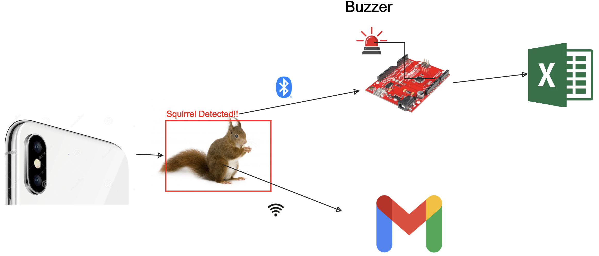
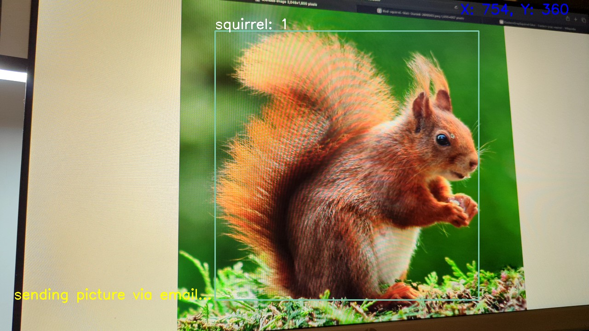

## Android Squirrel Image Detection and Alert using YOLO (2023)

*(CEE575 - Sensors, Data, Smart Systems) self-directed class final project at the University of Michigan.*

**Team:** Muhammad Bahru Sholahuddin and Stefano Sion Pizzi.

### My Responsibility:
Developed an Android application to detect the presence of squirrels, alert the user via a buzzer, update their position in a 2D frame using Google Sheets, and send their pictures.

### Strategy:
- Collected 1,810 squirrel images and annotations from Google APIs to create the dataset.
- Implemented the You Only Look Once (YOLO) version 3 algorithm for training and testing the dataset using Google Colab, and analyzed the optimal kernel size.
- Created an Android project using the OpenCV library to read the trained data. When a squirrel is detected, the app sends its position within the 2D frame via Bluetooth and emails the picture to the user.
- Programmed the SparkFun Photon RedBoard via Particle Web IDE to receive data from the Android app using the HC-05 module through the Universal Asynchronous Receiver Transmitter (UART) protocol. When a squirrel is detected, the system rings the buzzer and updates the squirrel's position in Google Sheets using the If This Then That (IFTTT) protocol.

### Links:
- [GitHub](https://github.com/mbsbahru/squirrel-detection-android)
- [Application](https://drive.google.com/file/d/1CiFBwprxuGFiuzDlLiYJxehNs_Sfk4YU/view?usp=sharing)
- [Video](https://drive.google.com/file/d/1zEdJWV1k0I3CAFBL1L8PJxqurIfKoDfc/view?usp=sharing)

### Preview:

