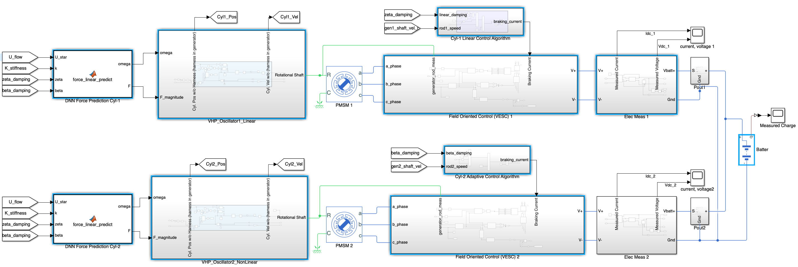

Master's research project at the Marine Renewable Energy Lab (MRELab).

**Team:** Muhammad Bahru Sholahuddin, Prof. Michael M. Bernitsas (Advisor).

### My Responsibility:
I selected the novel control strategy and designed a comprehensive system model of the VIVACE (Vortex Induced Vibration Aquatic Clean Energy) marine hydrokinetic converter in Matlab Simulink. Additionally, I developed the control algorithm, tested the generators, and optimized the damping parameters to enhance the overall energy harnessing efficiency.

### Strategy:
- Designed a complete system model of the VIVACE converter in Matlab Simulink, incorporating components such as the hydrodynamic model, spring-mass-damper system, control algorithm, power generation unit, and battery load system for cohesive performance.
- Modeled hydrodynamic interactions using a deep neural network, trained on a large dataset of experimental measurements, to represent fluid-structure interactions and predict dynamic responses under various flow conditions.
- Applied Field-Oriented Control (FOC) with a Permanent Magnet Synchronous Motor (PMSM) to adjust the damping force dynamically, efficiently converting mechanical to electrical energy while responding to changing flow rates and environmental conditions.
- Conducted system identification to estimate generator parameters such as flux linkage ($$\lambda$$), internal resistance ($$R$$), and inductances ($$L_q$$ and $$L_d$$), tuning the control system for real-world conditions.
- Tested real-world generator setups to evaluate efficiency versus rotational speed and power output, selecting the most suitable configuration for different operational scenarios.
- Fine-tuned FOC control gains for stable operation and high efficiency across a range of environmental and operational settings.
- Developed a control algorithm capable of real-time adjustment based on instantaneous damping coefficients and generator speed, maintaining optimal performance in varying flow conditions.
- Analyzed and evaluated power output and system efficiency under various test conditions, including different water flow rates, spring stiffness, and damping coefficients. Created a surrogate model representing system performance across these variables.
- Optimized linear and non-linear damping parameters using meta-heuristic algorithms like Particle Swarm Optimization (PSO) and Genetic Algorithms (GA) for maximum energy extraction under diverse environmental conditions.

### Links:
- [Control Algorithm](https://drive.google.com/file/d/1QbIjAARRwlIIg8jJGOJzNNSDdK-J1_Ia/view?usp=sharing)
- [NDA Agreement (Files containing VIVACE data are still undisclosed)](https://drive.google.com/file/d/1Bi-lPul0TiqeJr-tpMPW62NcKDjgcdkY/view?usp=sharing)

### Preview:

