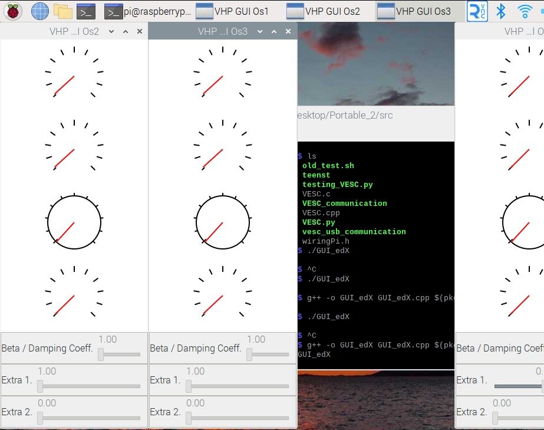

Summer Research Project at the Marine Renewable Energy Lab (MRELab).

**Team:** Muhammad Bahru Sholahuddin, Pratik Shiveshwar, and Prof. Michael M. Bernitsas (Advisor).

### My Responsibility:
Converted the existing Raspberry Pi GUI Python program, used for interfacing with VIVACE parameters, into a C++ application. Implemented the Lightweight Communications and Marshalling (LCM) library for inter-process communication and real-time data visualization. Ensured compatibility with the lab's hardware setup and reduced control and monitoring latency of the system.

### Strategy:
- Emulated the Raspberry Pi OS using QEMU (Quick Emulator) CLI to test the program without utilizing lab hardware, allowing for more efficient development and testing cycles.
- Migrated the existing Python-based GUI developed using `tkinter` to the `gtkmm` library for building the GUI in C++, providing improved performance.
- Integrated the LCM library to facilitate communication between the GUI and various sensor systems, such as the encoder and programmable load controllers, ensuring more real-time monitoring.
- Developed widgets for real-time visualization, including dynamic gauges and sliders, to display critical parameters such as generator voltage, current, encoder position, and velocity.
- Implemented a multi-threaded architecture to handle concurrent data processing and GUI updates, improving the responsiveness and reliability of the interface under high-frequency data transmission.
- Conducted testing of the application on the emulated environment to identify and resolve potential issues before deployment on the actual hardware.

### Links:
- [Project Code](https://drive.google.com/file/d/1mrszazPAsx-A8ybuW5P6sL-GKlr_77TC/view?usp=sharing)

### Preview:

